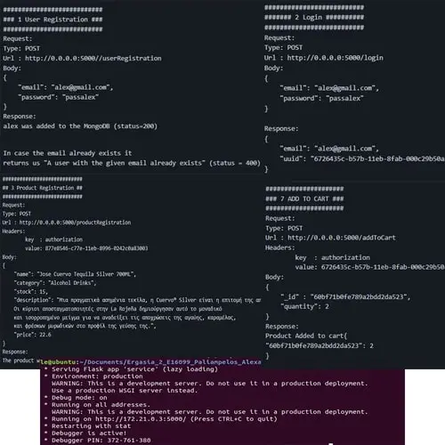
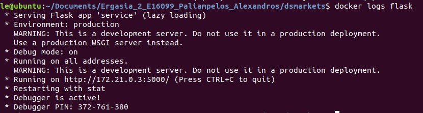

<h1>DSMarkets</h1>

Containerized Web App using Docker, Flask, and MongoDB

In this web app you can register, log in, add/edit/remove products, add products to a cart, get product info, and place an order via web services. You can download Postman to send requests to the server!

 
 

<h3>How to run this project</h3>

docker-compose is responsible for the simultaneous operation of 2 containers (MongoDB, Flask). 
The Docker image is based on Ubuntu 18.04, uses Python3 and pip, includes a data folder*, exposes port 5000, and uses <code>service.py</code> as its entrypoint.

<ol>
<li>
Clone the repo and then cd into dsmarkets:
<pre>$ cd dsmarkets $ ls docker-compose.yml  flask</pre></li>
<li>
From this folder run Docker with the command:
<pre>$ docker-compose up -d</pre></li>
<li>
When the 2 containers are running you will see the following message:

</li>
<li>
Copy the 2 collections to the MongoDB container:

<pre>$ docker cp flask/data/users.json mongodb:/users.json && docker cp flask/data/products.json mongodb:/products.json</pre></li>
<li>
Finally, import the 2 files into the InfoSys database:

<pre>$ docker exec -it mongodb mongoimport --db=InfoSys --collection=Users --file=users.json && docker exec -it mongodb mongoimport --db=InfoSys --collection=Products --file=products.json</pre></li>
<li>
Confirm that the Flask service is up and running without issues:
<pre>$ docker logs flask</pre>
</li>
</ol>

Note: 
Since users who register through the web service are granted only regular user privileges (not administrator), to add an administrator run: 
<pre>$ docker exec -it mongodb mongo --port 27017 $ db.Users.insertOne({"email":"admin@dsmarket.com","password":"admin","category":"administrator"})</pre>
The above admin account has already been added to the <code>Users</code> collection.

 
 

<h3>Below are examples of requests and the responses received at each endpoint</h3>
<pre>
###########################
### 1 User Registration ###
###########################
Request:
Type: POST
Url : http://0.0.0.0:5000/userRegistration
Body:
{
    "email": "alex@gmail.com", 
    "password": "passalex"
}

Response:
alex was added to the MongoDB (status=200)

In case the email already exists it
returns "A user with the given email already exists" (status = 400)
</pre>
 
<pre>
##########################
####### 2 Login ##########
##########################
Request:
Type: POST
Url : http://0.0.0.0:5000/login
Body:
{
    "email": "alex@gmail.com", 
    "password": "passalex"
}

Response:
{
    "email": "alex@gmail.com",
    "uuid": "6726435c-b57b-11eb-8fab-000c29b50a20"
}

In case the email + password combination does not exist
it returns "Wrong email or password" (status=400)
</pre>
 
<pre>
############################
## 3 Product Registration ##
############################
Request:
Type: POST
Url : http://0.0.0.0:5000/productRegistration
Headers:
	key  : authorization
	value: 877e8546-c77e-11eb-8996-0242c0a83003
Body:
{
    "name": "Jose Cuervo Tequila Silver 700ML", 
    "category": "Alcohol Drinks",
    "stock": 15,
    "description": "Μια πραγματικά ασημένια τεκίλα, η Cuervo® Silver είναι η επιτομή της απαλότητας. 
    Οι κύριοι αποσταγματοποιητές στην La Rojeña δημιούργησαν αυτό το μοναδικό 			    
    και ισορροπημένο μείγμα για να αναδείξει τις αποχρώσεις της αγαύης, καραμέλας, 
    και φρέσκων μυρωδικών στο προφίλ της γεύσης της.",
    "price": 22.6
}

Response:
The product with name 'Jose Cuervo Tequila Silver 700ML' was added to the MongoDB

-> If the UUID is not in the list then
   it returns "You do not have authorization, get out!" (status = 401)

Note: This endpoint requires logging in as an administrator and using the corresponding auth key.
</pre>
 
<pre>
##########################
### 4 Product Deletion ###
##########################
Request:
Type: DELETE
Url : http://0.0.0.0:5000/productDeletion
Headers:
	key  : authorization
	value: 877e8546-c77e-11eb-8996-0242c0a83003
Body:
{ "_id":"60be81cf8db7ab143482ccf7" }

Response:
Product with id: 60be81cf8db7ab143482ccf7, was deleted.

-> If the UUID is not in the list then
   it returns "You have no authorization, get out!" (status = 401)
-> If the _id does not exist then it returns:
   "Product with ID: 60be81cf8db7ab143482ccf7, not available on DB."

Note: This endpoint requires logging in as an administrator and using the corresponding auth key.
</pre>
 
<pre>
########################
### 5 Product Update ###
########################
Request:
Type: PUT
Url : http://0.0.0.0:5000/productUpdate?name=Αυγά%20Βιολογικά%20Medium%206%20Τεμ%20OFFER!!&price=3.80&stock=5
Headers:
	key  : authorization
	value: 6726435c-b57b-11eb-8fab-000c29b50a20
Body:
{ "_id":"60be81978db7ab143482ccf6" }

Response:
Product's info updated: {
    name": "Αυγά Βιολογικά Medium 6 Τεμ OFFER!!",
    "category": "Dairy Products",
    "stock": 5,
    "description": "Τα «Αυγά Βιολογικής Γεωργίας» από τα ΧΡΥΣΑ ΑΥΓΑ παράγονται 
    από κότες που ζουν ελεύθερες σε εύφορους αγρότοπους και τρέφονται αποκλειστικά 
    και μόνο με τις πιο αγνές, φυτικές τροφές Βιολογικής Γεωργίας.",
    "price": 3.8
}

-> If the UUID is not in the list then
   it returns "You have no authorization, get out!" (status = 401)
-> If the _id does not exist then it returns:
   "Product doesn't exist in DB."

Note: This endpoint requires logging in as an administrator and using the corresponding auth key.
</pre>
 
<pre>
#####################
### 6 GET PRODUCT ###
#####################
Request:
Type: GET
Url : http://0.0.0.0:5000/getProduct
Headers:
	key  : authorization
	value: 6726435c-b57b-11eb-8fab-000c29b50a20
Body:
{"name" : "Avga Viologika Medium 6 Tem OFFER!!"}
or 
{ "category" : "Dairy Products" } 
or 
{ "_id" : "60be81978db7ab143482ccf6" }

Response:
Found 4 product(s) with the category: Dairy Products [
    {
        "name": "Fresko Gala Elafry 1,5% Lipara 1 lt, OLYMPOS",
        "description": "Το 100% ελληνικό φρέσκο επιλεγμένο γάλα ΟΛΥΜΠΟΣ συλλέγεται καθημερινά 
	από επιλεγμένες μονάδες που βρίσκονται σε μικρές αποστάσεις από τις εγκαταστάσεις μας 
	και πληροί αυστηρότερα στάνταρ από αυτά που προβλέπει η ευρωπαϊκή νομοθεσία.",
        "price": 1.48,
        "category": "Dairy Products",
        "product ID": "60be81658db7ab143482ccf5"
    },
    {
        "name": "Avga Viologika Medium 6 Tem OFFER!!",
        "description": "Τα «Αυγά Βιολογικής Γεωργίας» από τα ΧΡΥΣΑ ΑΥΓΑ παράγονται από κότες 
	που ζουν ελεύθερες σε εύφορους αγρότοπους και τρέφονται αποκλειστικά και μόνο με τις 
	πιο αγνές, φυτικές τροφές Βιολογικής Γεωργίας.",
        "price": 3.5,
        "category": "Dairy Products",
        "product ID": "60bf71b0fe789a2bdd2da523"
    },
    {
        "name": "Avga Viologika Medium 6 Tem OFFER!!",
        "description": "Τα «Αυγά Βιολογικής Γεωργίας» από τα ΧΡΥΣΑ ΑΥΓΑ παράγονται από κότες 
	που ζουν ελεύθερες σε εύφορους αγρότοπους και τρέφονται αποκλειστικά και μόνο με τις 
	πιο αγνές, φυτικές τροφές Βιολογικής Γεωργίας.",
        "price": 3.8,
        "category": "Dairy Products",
        "product ID": "60be81978db7ab143482ccf6"
    },
    {
        "name": "Avga Viologika Medium 12 Tem OFFER!!",
        "description": "Τα «Αυγά Βιολογικής Γεωργίας» από τα ΧΡΥΣΑ ΑΥΓΑ παράγονται από κότες
	που ζουν ελεύθερες σε εύφορους αγρότοπους και τρέφονται αποκλειστικά και μόνο με τις 
	πιο αγνές, φυτικές τροφές Βιολογικής Γεωργίας.",
        "price": 6.4,
        "category": "Dairy Products",
        "product ID": "60bf710afe789a2bdd2da522"
    }
]

-> If the UUID is not in the list then
   it returns "You don't have authorization, get out!" (status=401)
-> Search by name => alphabetical sort
-> Search by price => price sort
-> If the search fails, a corresponding error message is displayed

Note: This endpoint requires logging in as a regular user and using the corresponding auth key.
</pre>
 
<pre>
#####################
### 7 ADD TO CART ###
#####################
Request:
Type: POST
Url : http://0.0.0.0:5000/addToCart
Headers:
	key  : authorization
	value: 6726435c-b57b-11eb-8fab-000c29b50a20
Body:
{
    "_id" : "60bf71b0fe789a2bdd2da523",
    "quantity": 2
}

Response:
Product Added to cart{
    "60bf71b0fe789a2bdd2da523": 2
}

-> If the UUID is not in the list then
   it returns "You don't have authorization, get out!" (status=401)
-> If the product ID does not exist or if the quantity is not an integer,
   a corresponding error message is returned
-> Resending the request for the same ID will increase the quantity accordingly
-> The stock limit of the product is always enforced

Note: This endpoint requires logging in as a regular user and using the corresponding auth key.
</pre>
 
<pre>
####################
###### 8 CART ######
####################
Request:
Type: GET
Url : http://0.0.0.0:5000/cart
Headers:
	key  : authorization
	value: 6726435c-b57b-11eb-8fab-000c29b50a20

Response:
Here is your cart
{
    "Jose Cuervo Tequila Silver 700ML": 2,
    "Fresko Gala Elafry 1,5% Lipara 1 lt, OLYMPOS": 2,
    "Avga Viologika Medium 6 Tem OFFER!!": 1
}
Total: 51.96

-> If no product has been added to the cart then
   it returns "First you have to add products to cart." (status = 200)
-> If the UUID is not in the list then
   it returns "You do not have authorization, get out!" (status = 401)
   
Note: This endpoint requires logging in as a regular user and using the corresponding auth key.
</pre>
 
<pre>
########################
## 9 REMOVE FROM CART ##
########################
Request:
Type: DELETE
Url : http://0.0.0.0:5000/removeFromCart/60be81978db7ab143482ccf6
Headers:
	key  : authorization
	value: 6726435c-b57b-11eb-8fab-000c29b50a20

Response:
Product has been removed from cart
Your new cart
{
    "Jose Cuervo Tequila Silver 700ML": 2,
    "Fresko Gala Elafry 1,5% Lipara 1 lt, OLYMPOS": 2
}
Total: 48.16

-> If the cart is empty then
   it returns "First you have to add products to cart." (status = 500)
-> If the product is not in the cart then
   it returns "Product has not been added to cart." (status = 500)
-> If the UUID is not in the list then
   it returns "You do not have authorization, get out!" (status = 401)

Note: This endpoint requires logging in as a regular user and using the corresponding auth key.
</pre>
 
<pre>
########################
## 10 PLACE AN ORDER ###
########################
Request:
Type: POST
Url : http://0.0.0.0:5000/order
Headers:
	key  : authorization
	value: 6726435c-b57b-11eb-8fab-000c29b50a20
Body:
{
    "card_no" : 1234567812345678
}

Response:
Here is your receipt

We are charging the amount of 77.26 and then we place the order
********DS MARKETS********
AFM: 099360626, DOY:PEIRAIA
Ilioupoleos 56,
17236, GR
**************************
{
    "Patron Silver Tequila 35cl": 2,
    "Avga Viologika Medium 12 Tem OFFER!!": 3
}
Value: 77.26
Thank you for choosing us!
***09/06/2021 09: 16: 55***

-> If "card_no" is not a 16-digit integer then
   it returns "You have to enter a 16-digit number" (status = 500)
-> If the cart is empty then
   it returns "Cart is empty." (status = 500)
-> If the UUID is not in the list then
   it returns "You do not have authorization, get out!" (status = 401)

Note: This endpoint requires logging in as a regular user and using the corresponding auth key.
</pre>
 
<pre>
########################
## 11 ORDERS HISTORY ###
########################
Request:
Type: GET
Url : http://0.0.0.0:5000/getOrders
Headers:
	key  : authorization
	value: 6726435c-b57b-11eb-8fab-000c29b50a20

Response:
You have placed 2 orders.
Details: [
    {
        "Fresko Gala Elafry 1,5% Lipara 1 lt, OLYMPOS": 1,
        "Αυγά Βιολογικά Medium 6 Τεμ OFFER!!": 1
    },
    {
        "Patron Silver Tequila 35cl": 2,
        "Avga Viologika Medium 12 Tem OFFER!!": 3
    }
]

-> If no order has been placed (orderHistory == 0) then
   it returns "You have to place an order first." (status = 500)
-> If the UUID is not in the list then
   it returns "You do not have authorization, get out!" (status = 401)

Note: This endpoint requires logging in as a regular user and using the corresponding auth key.
</pre>
 
<pre>
########################
## 12 DELETE ACCOUNT ###
########################
Request:
Type: DELETE
Url : http://0.0.0.0:5000/deleteAccount	
Headers:
	key  : authorization
	value: 6726435c-b57b-11eb-8fab-000c29b50a20

Response:
You are logged out.
And your account has been removed.

-> If the UUID is not in the list then
   it returns "You do not have authorization, get out!" (status = 401)

Note: This endpoint requires logging in as a regular user and using the corresponding auth key.
</pre>

